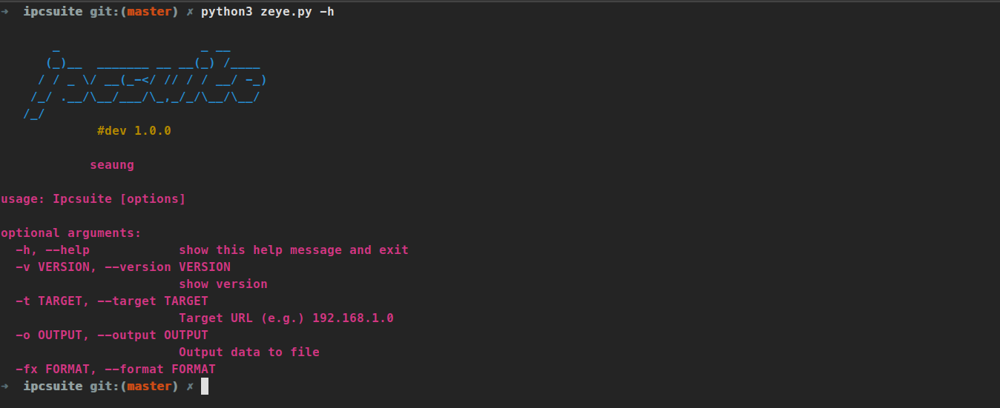

# IPCSuite

IPCSuite是一款基于Python3开发的摄像头安全审计工具，主要用于检测网络摄像头设备的安全漏洞。该工具采用多线程并发扫描技术，内置多个POC检测脚本，可以快速高效地发现摄像头系统中存在的安全隐患。



## 主要功能

- 支持多种品牌摄像头漏洞检测
- 内置多个POC检测脚本，覆盖常见漏洞类型
- 支持多线程并发扫描，提高检测效率
- 自动生成扫描报告，支持多种格式输出
- 目前只支持单目标扫描

## 环境要求

- Python 3.x
- 依赖包要求：
  - requests>=2.32.3
  - urllib3>=2.3.0
  - certifi>=2025.1.31
  - charset-normalizer>=3.4.1
  - idna>=3.10

## 安装方法

1. 克隆项目代码
```bash
git clone https://github.com/seaung/ipcsuite.git
cd ipcsuite
```

2. 安装依赖包
```bash
pip install -r requirements.txt
```

## 使用方法

### 基本用法

```bash
# 扫描单个目标
python zeye.py -t http://target-ip

# 指定输出格式和文件
python zeye.py -t http://target-ip -f json -o result.json

# 自定义线程数和超时时间
python zeye.py -t http://target-ip -n 20 -T 60
```

### 命令行参数说明

- `-v, --version`: 显示版本信息
- `-t, --target`: 指定目标URL（例如：192.168.1.0）
- `-o, --output`: 指定输出文件路径
- `-f, --format`: 指定输出格式（支持json/txt/html，默认：txt）
- `-n, --threads`: 设置扫描线程数（默认：10）
- `-T, --timeout`: 设置请求超时时间（单位：秒，默认：30）
- `-d, --debug`: 启用调试模式

### 扫描结果

扫描完成后，结果将保存在results目录下，包含以下信息：
- 扫描时间和目标信息
- 检测到的漏洞详情
- 漏洞风险等级
- 修复建议

支持的输出格式：
- TXT格式：scan_result_[timestamp].txt
- JSON格式：scan_result_[timestamp].json

## 工程目录结构

```
.
├── commons/          # 通用组件目录
│   ├── __init__.py
│   └── outputs.py    # 输出处理模块
├── db/              # payloads目录
│   └── dirctorytraversal.ipcsuite
├── lib/             # 自定义库文件目录
│   ├── __init__.py
│   ├── cmd.py       # 命令行参数处理
│   ├── color.py     # 终端颜色输出
│   ├── data.py      # 数据处理
│   ├── loader.py    # POC加载器
│   ├── logger.py    # 日志处理
│   ├── requests.py  # HTTP请求
│   └── threads.py   # 线程管理
├── pocs/            # POC检测脚本目录
│   ├── __init__.py
│   └── hikvision_*.py
├── results/         # 扫描结果输出目录
├── pic/             # 项目图片资源
├── LICENSE
├── README.md
├── requirements.txt
└── zeye.py         # 程序主入口文件
```

## 免责声明

本工具仅用于安全研究和授权测试，使用本工具进行任何未授权的测试都可能违反相关法律法规。使用者需要遵守当地法律法规，如果因使用本工具造成任何损失，由使用者自行承担全部责任。
